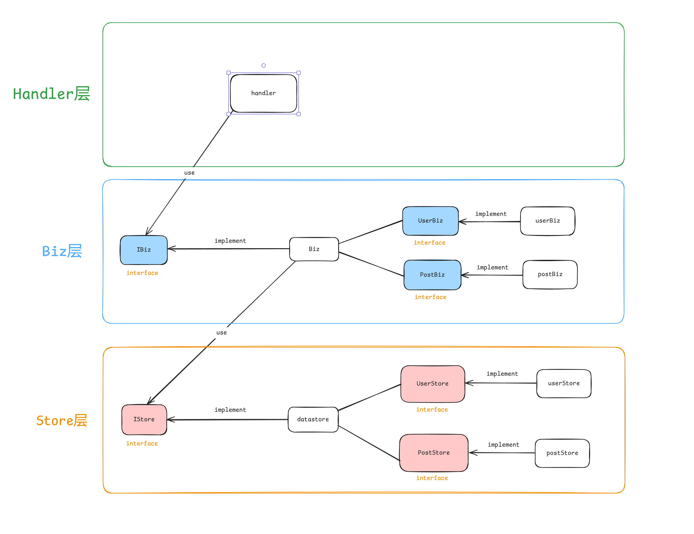

## fast_blog project

[](https://deepwiki.com/loveRyujin/fast_blog)

## 项目快速部署
```bash
$ mkdir -p  $HOME/golang/src/github.com/onexstack_practice/
$ cd $HOME/golang/src/github.com/onexstack_practice/
$ git clone https://github.com/onexstack_practice/fast_blog
$ cd fast_blog/
$ ./build.sh
$ _output/fg-apiserver -c configs/fg-apiserver.yaml
```

## 项目结构
<details>
<summary>展开看看</summary>
<pre><code>
.
├── build.sh
├── cmd
│   └── fb-apiserver
│       ├── app
│       │   ├── config.go
│       │   ├── options
│       │   │   └── options.go
│       │   └── server.go
│       └── main.go
├── configs
│   └── fb-apiserver.yaml
├── docs
│   └── images
│       └── architecture.png
├── go.mod
├── go.sum
├── internal
│   ├── apiserver
│   │   ├── biz
│   │   │   ├── biz.go
│   │   │   └── v1
│   │   │       ├── post
│   │   │       │   └── post.go
│   │   │       └── user
│   │   │           └── user.go
│   │   ├── handler
│   │   │   ├── handler.go
│   │   │   ├── post.go
│   │   │   └── user.go
│   │   ├── model
│   │   │   ├── hook.go
│   │   │   ├── post.gen.go
│   │   │   └── user.gen.go
│   │   ├── pkg
│   │   │   ├── conversion
│   │   │   │   ├── post.go
│   │   │   │   └── user.go
│   │   │   └── validation
│   │   │       ├── post.go
│   │   │       ├── user.go
│   │   │       └── validation.go
│   │   ├── server.go
│   │   └── store
│   │       ├── post.go
│   │       ├── store.go
│   │       └── user.go
│   └── pkg
│       ├── contextx
│       │   └── contextx.go
│       ├── core
│       │   └── core.go
│       ├── errorx
│       │   ├── code.go
│       │   ├── errorx.go
│       │   ├── post.go
│       │   └── user.go
│       ├── known
│       │   └── known.go
│       ├── middleware
│       │   ├── auth.go
│       │   ├── header.go
│       │   └── requestid.go
│       └── rid
│           ├── cover.out
│           ├── rid.go
│           ├── rid_test.go
│           └── salt.go
├── _output
│   └── fb-apiserver
├── pkg
│   ├── api
│   │   └── apiserver
│   │       └── v1
│   │           ├── post.go
│   │           └── user.go
│   ├── auth
│   │   └── auth.go
│   ├── options
│   │   └── mysql_options.go
│   ├── token
│   │   └── token.go
│   └── version
│       ├── flag.go
│       └── version.go
├── README.md
└── scripts
    └── test.sh
</pre></code>
</details>

## 项目架构图：

